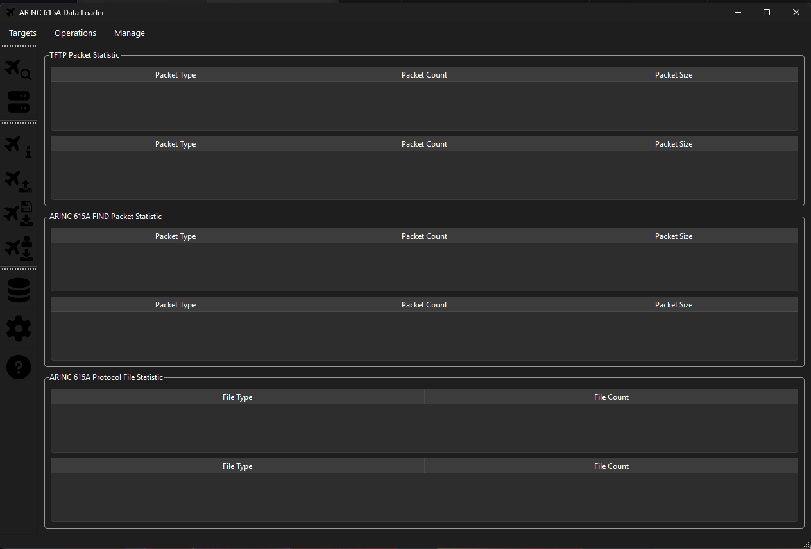
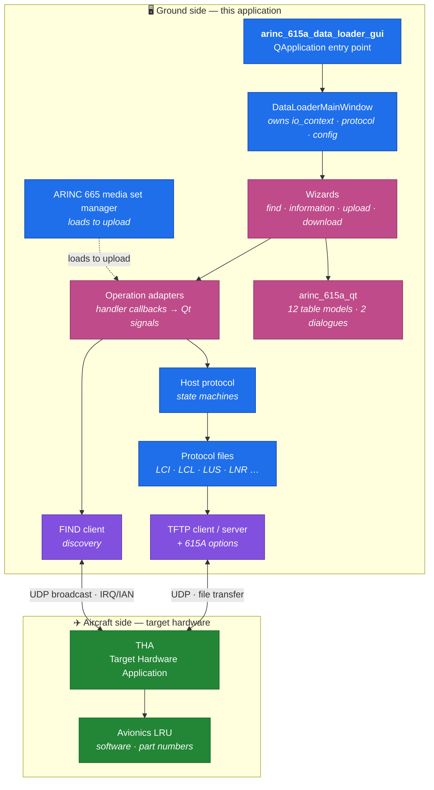
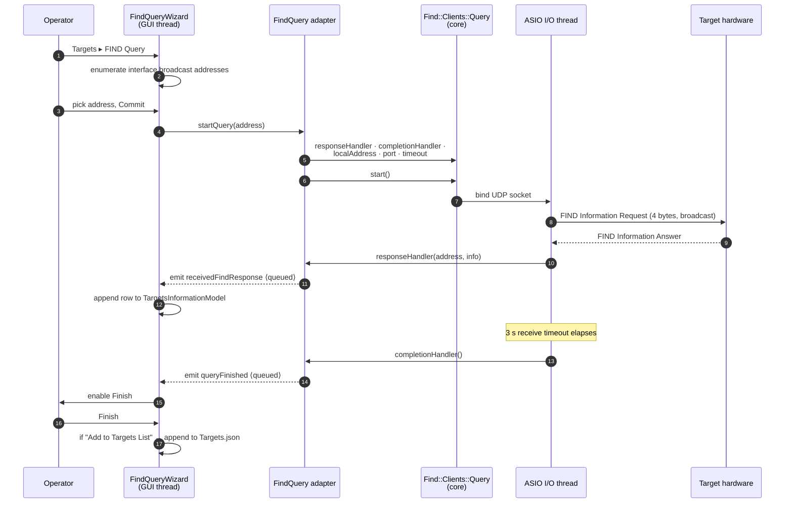
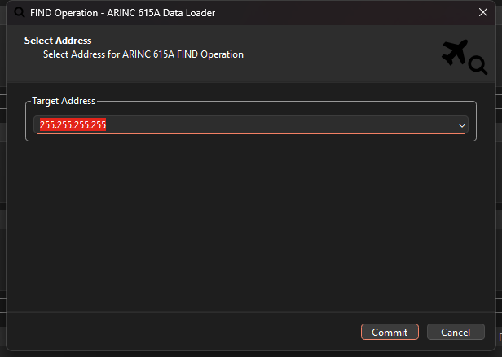
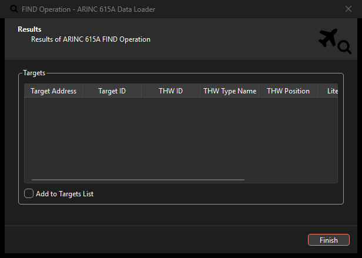
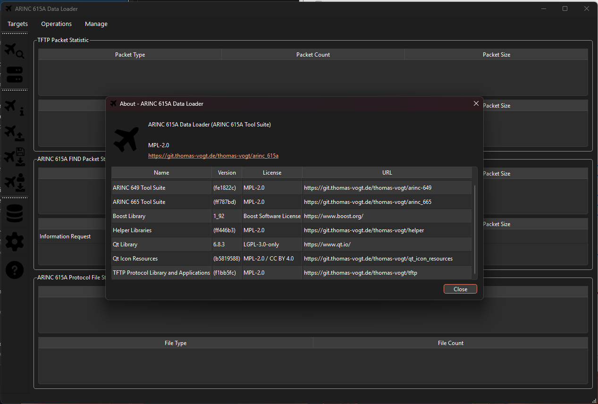

<div align="center">


# ARINC 615A Tool Suite — GUI

**Graphical implementation of the ARINC 615A Data Loading Protocol**
Discover avionics targets, read part numbers, upload and download software over Ethernet — driven from wizards instead of a command line.

[](https://en.cppreference.com/w/cpp/23)
[](https://cmake.org/)
[](https://www.qt.io/)
[](https://www.boost.org/)
[](https://visualstudio.microsoft.com/)

[](#quick-start--one-command)
[](https://vcpkg.io/)
[](LICENSE)
[](#protocol-background)

</div>

---

## What this is

ARINC 615A is the standard the aviation industry uses to move software and data
between a ground **data loader** and **target hardware** on an aircraft — the
LRUs, computers and controllers that need software updates. It defines the
message formats, the transfer procedures, and the error detection that protects
data integrity.

This repository builds `arinc_615a_data_loader_gui`, a Qt 6 desktop application
that speaks that protocol. It can:

- **discover** targets on the network (FIND),
- **interrogate** them for part numbers and versions,
- **upload** software and data to them,
- **download** software and data from them, and
- manage the **ARINC 665 media sets** the software is packaged in.



It is the **graphical section** of the upstream
[ARINC 615A Tool Suite](https://git.thomas-vogt.de/thomas-vogt/arinc_615a) by
Thomas Vogt, extracted into a standalone project with added build glue,
scripts and documentation. Its sibling repository,
[arinc-615a-cli-tool-suite](https://github.com/Hitheshkaranth/arinc-615a-cli-tool-suite),
is the command-line section — **the same protocol core, a different driver**.

> The protocol core (`lib/arinc_615a`) is vendored here rather than fetched,
> because the graphical section cannot build without it. What is excluded is the
> command-line section: `arinc_615a_commands` and `arinc_615a_operation` are not
> part of this repository.

---

## CLI or GUI — which do you want?

Both front ends put identical bytes on the wire. A packet capture of an
information operation cannot tell them apart. Choose on how you work, not on
what the protocol does.

| You want to… | Use |
| --- | --- |
| Script a load into CI, or a repeatable release procedure | **CLI** — a command line is a record of exactly what was done |
| Run a **batch upload** across many targets | **CLI** — `BatchUpload` and `UploadLoads` have no GUI equivalent |
| Drive it headless, over SSH, or from another program | **CLI** — the GUI has no headless mode |
| Find out what is on an unfamiliar network | **GUI** — it enumerates every interface broadcast address for you |
| Watch a long upload and see which load is where | **GUI** — per-load and per-file progress tables, retained status log |
| Hand the job to someone who is not a protocol engineer | **GUI** — wizards gate each step and refuse to advance on bad input |
| Keep a target list between sessions | **GUI** — `Targets.json` persists automatically |

`Targets.json` uses the same schema as the CLI's `--targets-list`, so a target
list built in either front end is readable by the other.

---

## What it does — block diagram



The application is the **host** (ground data loader). The box on the aircraft is
the **target**. Everything on the data path is a *file* moved over TFTP — ARINC
615A is file-driven, not message-driven. FIND is the one exception: a plain UDP
request/answer pair used to discover what is out there before a transfer.

The pink band is what this repository adds over the CLI. Everything below it is
shared code.

---

## What really happens when you run it

A FIND query, end to end. Note where the thread changes.



Steps 11 and 15 are the only ones that cross threads, and both are explicit
`Qt::QueuedConnection`. That boundary is the substance of this repository — see
[docs/ARCHITECTURE.md](docs/ARCHITECTURE.md).

---

## How it works — the layers

```
  arinc_615a_data_loader_gui     resources, QApplication, show the window
  ────────────────────────────────────────────────────────────────────────
  DataLoaderMainWindow           io_context, FIND client, host protocol,
                                 configuration, target list, media sets
  ────────────────────────────────────────────────────────────────────────
  Wizards                        collect parameters, show live status,
   find · information ·          present the result
   upload · download
  ────────────────────────────────────────────────────────────────────────
  Operation adapters             implement the core's handler interfaces
                                 privately; re-emit every callback as a
                                 Qt signal  ← THREAD BOUNDARY
  ────────────────────────────────────────────────────────────────────────
  arinc_615a_qt                  QAbstractTableModel over ARINC 615A types
  ────────────────────────────────────────────────────────────────────────
  arinc_615a  (core)             host/target state machines, protocol file
                                 codec, FIND, TFTP + 615A options
```

Each layer knows only the one below it. The upward path is always a Qt signal or
an abstract handler interface bound at construction — which is exactly why the
core does not know a GUI exists.

### Two threads

| Thread | Runs | Owns |
| --- | --- | --- |
| **Qt GUI thread** (main) | `QApplication::exec()` | every widget, model and wizard |
| **ASIO I/O thread** (`std::jthread`) | `ioContext.run()` | every socket; all protocol callbacks land here |

An `executor_work_guard` keeps `run()` alive between operations. Shutdown is
`workGuard.reset()` then `ioThread.join()`, then configuration is saved.

Queued delivery copies its arguments, so every payload type is registered with
`qRegisterMetaType`. This is also why the handler's `std::string_view` becomes a
`std::string` on the signal — a view into a buffer owned by the I/O thread would
dangle before the GUI thread dequeued it.

---

## The five operations

| Operation | Wizard pages | What it does |
| --- | --- | --- |
| **FIND query** | Select address → Results | Broadcast discovery; optionally appends to the target list |
| **Information** | Settings → Status → Completed | Reads the target's `LCL` — part numbers, versions, target hardware |
| **Upload** | Settings → Status → Completed | Sends ARINC 665 loads; host acts as file server |
| **Media defined download** | Settings → Status → Completed | Host names the files it wants |
| **Operator defined download** | Settings → Select files → Status → Completed | Target advertises first, operator then chooses |

Upload is the only one gated on the ARINC 665 media set scan, so *Upload
Operation* and *Manage Media Sets* stay disabled until startup finishes.

The settings page of each wizard is a **commit page**: once *Commit* is pressed
the wizard cannot go back, which matches an operation that has already put a
packet on the wire. Once live, the plain *Cancel* button is replaced by *Abort
Operation*, wired to the protocol's own abort request rather than to closing the
dialogue.

---

## Quick start — one command

```bat
build.bat
```

Configure, build, deploy the Qt runtime, launch. `build.bat --no-run` stops
after deploying.

Qt is the one prerequisite the script will not install for you:

```bat
python -m pip install aqtinstall
python -m aqt install-qt windows desktop 6.8.3 win64_msvc2022_64 -O ..\Qt
```

About 80 seconds. The vcpkg `with-qt` feature would build `qtbase` and `qtsvg`
from source instead — hours, and tens of gigabytes.

> Do **not** pass `-m qtsvg`. For 6.8.3 it fails with *"The packages ['qtsvg']
> were not found"*; Qt SVG is already in the base package. It is not optional at
> runtime — without its `qsvg` image-format plugin the application starts but
> every icon renders blank.

### Or run the steps separately

```bat
scripts\configure-gui.bat
scripts\build-gui.bat
scripts\deploy-qt.bat      REM once, before the first launch
scripts\run-gui.bat
```

---

## ⚠ Two environment traps

`vcvars64.bat` is not neutral. It changes two things this build depends on, and
both failures look unrelated to their cause.

| It does this | You see | Handled by |
| --- | --- | --- |
| Injects **its own `VCPKG_ROOT`**, pointing at Visual Studio's bundled vcpkg | A fresh 84-package vcpkg build, or missing-package errors | `scripts\env-gui.bat` captures your value first and restores it |
| Prepends **CMake 3.31** to `PATH`, ahead of the required 4.3 | `CMake 4.3 or higher is required. You are running version 3.31.6-msvc6` | `scripts\env-gui.bat` resolves `CMAKE_EXE` explicitly |

Three variables override the defaults if you set them before calling:

| Variable | Default |
| --- | --- |
| `CMAKE_EXE` | bundled CMake 4.3.4, else `cmake` on `PATH` |
| `VCPKG_ROOT` | sibling `.tools/vcpkg` |
| `QT6_DIR` | `..\Qt\6.8.3\msvc2022_64` |

---

## ⚠ The executable needs two sets of DLLs

A freshly built binary will not start from the build tree.

**Qt** — `scripts\deploy-qt.bat` runs `windeployqt`, which copies `Qt6Cored`,
`Qt6Guid`, `Qt6Widgetsd`, `Qt6Networkd`, `Qt6Svgd` and `D3Dcompiler_47`, plus
five plugin directories: `platforms`, `styles`, `imageformats`, `tls`,
`networkinformation`.

**vcpkg** — the preset sets `VCPKG_APPLOCAL_DEPS=OFF`, so Boost, libxml++ and
spdlog are not copied. `scripts\run-gui.bat` puts
`cmake-build-msvc-static-debug-gui\vcpkg_installed\x64-windows\debug\bin` on
`PATH` before launching — nineteen DLLs.

---

## Smoke test — no hardware needed

*Targets ▸ FIND Query*, accept the broadcast address, *Commit*. After the
receive timeout *Finish* enables. Close the wizard and the main window counters
refresh:

```
ARINC 615A FIND Packet Statistic — TX
Packet Type            Packet Count   Packet Size
Information Request    1              4
```

One 4-byte FIND Information Request actually transmitted, no responses. That
single row exercises the whole stack — wizard, adapter, core, socket, timer,
completion handler, queued signal — with the only missing element being a target
that answers.

<div align="center">


</div>

---

## Where it keeps things

| File | Contents |
| --- | --- |
| `%TEMP%\arinc_615a_data_loader_gui.log` | spdlog output at `info` level — a windowed application has no console |
| `DataLoader.json` | FIND and ARINC 615A configuration, timeouts, port option, media set directory, download directory |
| `Targets.json` | Target address information — same schema as the CLI's `--targets-list` |

The last two live in the Qt application configuration location, which is why
`main()` sets the organisation name and domain before constructing anything.

---

## Repository layout

```
.
├── app/arinc_615a_data_loader_gui/   application entry point — ~90 lines
├── lib/
│   ├── arinc_615a/                   protocol core (vendored, no Qt)
│   │   ├── host/                     ground-loader state machines
│   │   ├── target/                   target-hardware state machines
│   │   ├── files/                    LCI · LCL · LUS · LNR … encode/decode
│   │   ├── find/                     discovery: packets · clients · servers
│   │   ├── tftp/                     615A-specific TFTP options
│   │   └── information/              shared value types
│   ├── arinc_615a_qt/                12 table models · 2 dialogues
│   └── arinc_615a_dla_qt/            main window · adapters · wizards · resources
│       ├── operations/               handler callbacks → Qt signals
│       ├── find/ information/        wizards, one directory each
│       ├── upload/ download/
│       └── resources/                SVG icon set (.qrc, AUTORCC)
├── cmake/                            install rules, presets, graphviz options
├── scripts/                          env · configure · build · deploy · run
├── docs/                             BUILD.md · ARCHITECTURE.md · CODE-TRACE.md
└── build.bat                         one command: configure + build + deploy + run
```

---

## Documentation

| Document | What's in it |
| --- | --- |
| **[docs/README.md](docs/README.md)** | **Start here** — a map of the documents, what each is for, and a reading order for a new maintainer |
| **[CONTRIBUTING.md](CONTRIBUTING.md)** | The local changes that must survive an upstream merge, layout rules, line-ending rules |
| **[docs/ARCHITECTURE.md](docs/ARCHITECTURE.md)** | How the codebase works — layer map, the thread boundary, directory-by-directory walkthrough, the adapter pattern, design conventions |
| **[docs/CODE-TRACE.md](docs/CODE-TRACE.md)** | A 22-section trace from `main()` to the wire and back through the queued signals, every entry carrying its `file:line`. Covers concurrency, the shell, each operation, the model layer, resources, the build, and three thread-affinity defects |
| **[docs/code-trace-html/arinc615a-gui-engineering.html](docs/code-trace-html/arinc615a-gui-engineering.html)** | The same trace as a styled, self-contained page for reading or circulation |
| **[docs/BUILD.md](docs/BUILD.md)** | Every build stage in order, the Qt acquisition options, the environment traps, and the deployment steps |

---

## Dependencies

| | Windows |
| --- | --- |
| Compiler | Visual Studio 2022 C++ build tools (MSVC 14.44) |
| Build system | **CMake ≥ 4.3** + Ninja |
| GUI toolkit | **Qt 6.8.3** `msvc2022_64`, installed via aqtinstall |
| Libraries from | **vcpkg**, via `vcpkg.json` |
| DLL handling | `windeployqt` for Qt, `PATH` for vcpkg — see above |

The compiler must support **C++23**; every target sets `cxx_std_23`.

**Libraries** — Boost (asio, crc, endian, exception, hash2, multi-index,
program-options, property-tree, serialization, signals2, test),
[libxml++](https://libxmlplusplus.github.io/libxmlplusplus/),
[spdlog](https://github.com/gabime/spdlog),
[fmt](https://fmt.dev/), pkgconf. `libxml++` is required by the `arinc_665`
dependency rather than by this repository's own libraries.

**Sibling projects**, cloned during configure via `FetchContent`:
[helper](https://git.thomas-vogt.de/thomas-vogt/helper) ·
[qt_icon_resources](https://git.thomas-vogt.de/thomas-vogt/qt_icon_resources) ·
[arinc_649](https://git.thomas-vogt.de/thomas-vogt/arinc-649) ·
[arinc_665](https://git.thomas-vogt.de/thomas-vogt/arinc_665) ·
[tftp](https://git.thomas-vogt.de/thomas-vogt/tftp) ·
[commands](https://git.thomas-vogt.de/thomas-vogt/commands)

Three of those contribute Qt libraries of their own — `helper_qt`, `tftp_qt` and
`arinc_665_qt` — each guarded by a `find_package( Qt6 ... QUIET )` that returns
early when Qt is absent.

> Configure **requires network access to `git.thomas-vogt.de`**. There is no
> vendored copy and no offline fallback.

The About dialogue reports exactly what a given build was linked against:



### Platform note

Only the **MSVC** presets are provided and exercised. The upstream project also
ships GCC, Clang and MinGW-cross presets; they are not carried here because the
deployment story (`windeployqt`, vcpkg DLL paths) is Windows-specific and has
not been tested on another platform. The code itself has no Windows-only
constructs beyond the explicit `wsock32`/`ws2_32` links.

---

## Known issues

Three code paths construct a `QMessageBox` off the GUI thread, which violates
Qt's thread-affinity rule that widgets are created and used only on the thread
that owns them:

| Location | Why it is on the wrong thread |
| --- | --- |
| `DataLoaderMainWindow` I/O thread body — both catch blocks | Runs inside `ioContext.run()` |
| `MediaDefinedDownloadOperation::finished()` catch block | Handler callback, so I/O thread |
| `OperatorDefinedDownloadOperation::finished()` catch block | Handler callback, so I/O thread |

All three are error paths, so they do not appear in normal operation. The fix in
each case is the shape the rest of the file already uses: emit a signal, let a
queued slot on the GUI thread show the dialogue. The other fifteen
`QMessageBox` call sites are inside slots invoked from the GUI thread and are
correct. Detail in [docs/CODE-TRACE.md § 21](docs/CODE-TRACE.md).

---

## Protocol background

This library implements **Supplements 2, 3 and 4**. Selected changes it accounts
for:

| Supplement | Notable changes |
| --- | --- |
| **615A-1** | Uppercase protocol filenames · UDP port 59 · block-size option mandatory for host · transfer-size and timeout options forbidden · exception timer added to status files |
| **615A-2** | SNIP renamed **FIND** and made optional before transfer · protocol version `A3` · `LCL` gains multiple target hardware and part-number amendments · exception timer and estimated time defined precisely |
| **615A-3** | Transfer-size and timeout options optional · **checksum** and **port** options added · status `0004` (in progress with description) · part-number option added but unusable as written |
| **615A-4** | Part-number option corrected · checksum option description updated |

**References** — ARINC 615A-4 (Software Data Loader Using Ethernet Interface),
ARINC 665-5 (Loadable Software Standards), ARINC 649 (Common Terminology and
Functions for Software Distribution and Loading).

---

## Licence

[](LICENSE)

Mozilla Public License 2.0. Upstream project © Thomas Vogt —
<https://git.thomas-vogt.de/thomas-vogt/arinc_615a>. The MPL requires this
licence and its attribution to be retained in redistributions, including this one.

**Qt 6 is used under LGPL-3.0-only** and is linked dynamically. It is not
redistributed in this repository; `windeployqt` copies it from your own Qt
installation at deploy time. Replacing the Qt libraries in a deployed
installation must remain possible, which dynamic linking preserves.

`qt_icon_resources` is MPL-2.0 / CC BY 4.0. Boost is under the Boost Software
Licence. The remaining sibling projects are MPL-2.0.

ARINC® is a trademark of its respective owner. This project implements the
publicly documented ARINC 615A protocol and is **not affiliated with, endorsed
by, or a product of ARINC**. The ARINC standards themselves are published by
SAE ITC and are not redistributed here.
